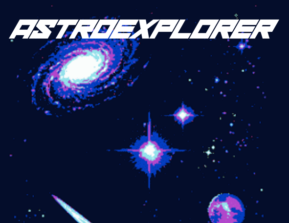
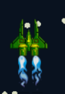
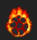
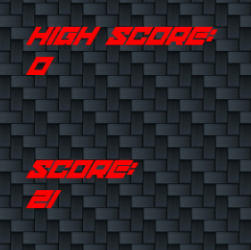
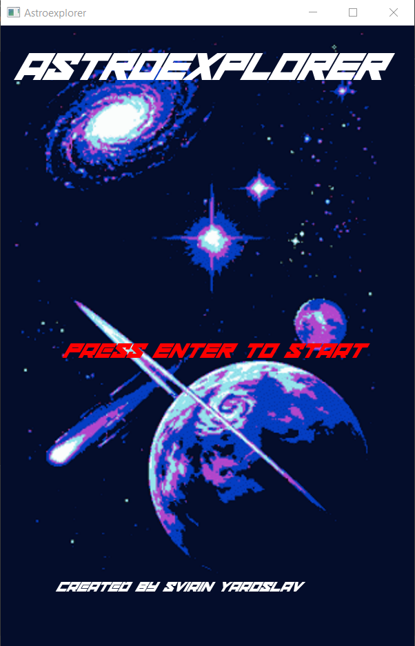
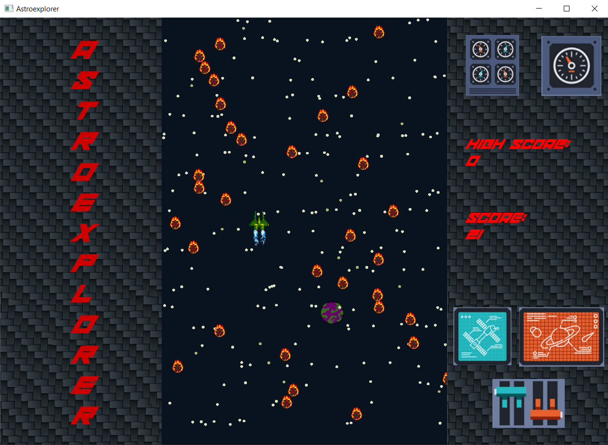
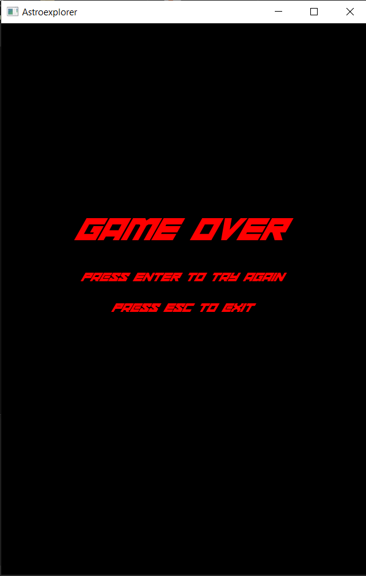

     

# Astroexplorer
     Моя первая игра на C++ с использованием библиотеки SFML

<h2 align="center"><i>Содержание</i></h2> 

- [Описание](#descr)
- [Цель проекта](#target)
- [Геймплей](#gameplay)
- [Скриншоты](#screenshots)

## Описание
Игра представляет собой раннер, в котором игрок берёт на себя управление
кораблём, что попал в метеоритный дождь. Главная задача - пролететь как
можно больше, не задев ни один из метеоритов.

## Цель проекта
Проект создавался в начале пути изучения языка С++. Поскольку библиотека
SFML является достаточно лёгкой в освоении, то в качестве практики и
закрепления материала по языку С++ было принято решение написать подобную игру.

## Геймплей

Основна задача игрока - управление кораблём в самом сердце метеоритного дождя.
На текущий момент времени человечество не придумало никаких защитних механизмов,
которые способны защитить корабль от прямого попадания в него астероида. А это
значит лишь одно - права на ошибку нет!

      
     <i>Корабль игрока</i>  
      
     <i>Астероид</i>  

Во время полёта у игрока накапливаются очки, которые отображают прогресс
игрока. За каждые 150 миллисекунд полёта игроку начисляется одно очко

     

## Скриншоты

      
     <i>Главное меню</i>  
      
     <i>Геймплей</i>  
      
     <i>Экран Game over</i>  

